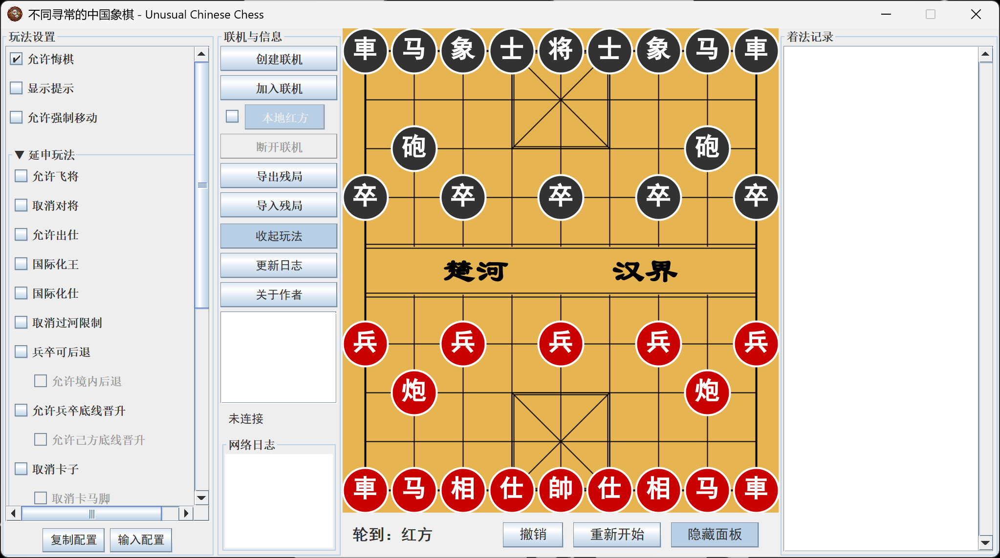

# UnusualChineseChess

<p align="center">
  
  <br>
  <b>An Unusual Chinese Chess based on Java.</b>
  <br>
</p>

<p align="center">
  
  
  
  
  <a href="https://deepwiki.com/Samera2022/UnusualChineseChess"></a>
</p>

## Preview
<p align="center">
  
<br>
  <sub style="font-size: 14px;"><i>The main interface of Unusual Chinese Chess.</i></sub>
</p>

## Features

*   **Extensive Rule Customization**: Break free from traditional gameplay with dozens of optional rules. Enable settings like "Piece Stacking," "Pawn Promotion," "Flying Generals," and many more.
*   **LAN Multiplayer**: Challenge a friend over your local network. The game supports hosting and joining LAN games with real-time synchronization of moves and rule changes.
*   **Rule-Based Engine**: The game is built on a flexible, rule-based engine that allows for easy addition of new, creative gameplay variations.
*   **Save & Load Games**: Export your current game state, including all custom rules and board positions, to a JSON file. Import them later to resume your game or share interesting scenarios.
*   **Intuitive UI**: A clean and straightforward interface that includes a move history panel, a dynamic rule settings panel, and real-time game status updates.
*   **Force Move**: A unique feature allowing players to suggest and (if agreed upon) execute moves that may not be traditionally valid, adding another layer of strategic depth.
*   **Developer-Friendly**: Designed with extensibility in mind. Adding new rules is a streamlined process. See [How to Create New Rules](docs/如何创建新玩法(2.X.X).md) for a guide.

## Getting Started

### Quick Launch
I. Jar User
1. Make sure that you have installed JRE 1.8 or above. If not, you can download [HERE](https://www.oracle.com/technetwork/cn/java/javase/downloads/jre8-downloads-2133155-zhs.html).
2. Download the latest `.jar` file from the [Releases](https://github.com/Samera2022/UnusualChineseChess/releases) page.
3. Double-click the jar file OR use cmd to run the application:
    ```bash
    java -jar UnusualChineseChess.jar
    ```
II. Exe User
1. Download the latest `.exe` file from the [Releases](https://github.com/Samera2022/UnusualChineseChess/releases) page.
2. Click to start! All environments are integrated into one `exe` file!

## Development Document

This project is designed to be extensible. If you have an idea for a new, unusual rule, it is encouraged for you to contribute!

*   **How to Contribute**: Please fork the repository, create a new branch for your feature, and submit a pull request.
*   **Adding New Rules**: I've created a step-by-step guide for developers. Please see [**How to Create New Rules in 2.X.X**](docs/如何创建新玩法(2.X.X).md) for more details. 
Specifically, if you want to develop on 1.X.X version, please refer to [**How to Create New Rules in 1.X.X**](docs/如何创建新玩法(1.X.X).md) for more details.

For more up-to-date documents, you can refer to [Samera2022/UnusualChineseChess | DeepWiki](https://deepwiki.com/Samera2022/UnusualChineseChess) or just click the badge at the top of the article， which offers weekly-updated docs for this project.

## Others

### Contributing
Contributions are welcome! If you find a bug or have a feature request, please open an issue.
### Author
**Developer: Samera2022**
* **GitHub**: [@Samera2022](https://github.com/Samera2022)
### License
This project is licensed under the GNU General Public License v3.0 License - see the `LICENSE` file for details.