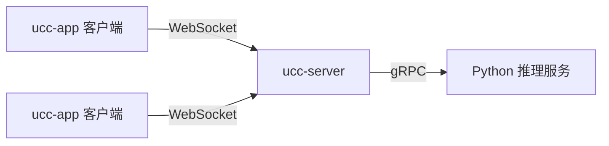

# UCC 全流程部署与运行文档

> 版本: 2.0  
> 日期: 2026-06-02  
> 项目: UnusualChineseChess (UCC) — 象棋变体游戏引擎 + 高并发服务端 + 强化学习训练

---

## 一、项目结构

```
UnusualChineseChess/
├── pom.xml                    # Maven 父模块（JDK 21）
├── ucc-common/                # 共享模型 + SPI + Protobuf
├── ucc-core/                  # 核心引擎（Board/GameEngine/MoveValidator）
├── ucc-api/                   # API 层（序列化/网络）
├── ucc-app/                   # Swing GUI 桌面客户端
├── ucc-ai/                    # AI/MCTS + Python 训练
│   ├── src/                   # Java MCTSAgent、TrainingDataCollector
│   └── python/                # Python 训练流水线
│       ├── train.py           #   自包含 AlphaZero 训练引擎
│       ├── inference_server.py #  gRPC 批量推理服务（GPU）
│       ├── selfplay.py        #   MCTS 搜索 + 自我对弈
│       ├── model.py           #   MiniResNet 神经网络
│       ├── pybridge.py        #   Java PyBridge 长驻进程
│       ├── export_onnx.py     #   ONNX 导出
│       └── compile_proto.py   #   Protobuf 编译
├── ucc-server/                # 高并发服务端（Netty WebSocket + gRPC + 训练编排）
│   └── src/.../train/
│       ├── TrainingOrchestrator.java  # 课程学习 + Worker 编排
│       ├── SelfPlayWorker.java        # 虚拟线程自博弈
│       ├── BatchingEngine.java        # LMAX Disruptor 批量推理
│       ├── GrpcInferenceClient.java   # gRPC 推理客户端
│       └── RedisReplayBuffer.java     # Redis 经验回放
├── scripts/
│   ├── setup_first.bat
│   ├── start_server.bat
│   └── start_training.bat
└── report/                    # 设计方案与审计报告
```

---

## 二、环境要求

### 硬件

| 组件 | 最低（本地测试） | 推荐（72 核生产服务器） |
|------|-----------------|----------------------|
| CPU | 4 核 | 72 核（低频，高核数优先） |
| RAM | 8 GB | 128 GB |
| GPU | — | **RTX 3060 12GB**（训练与推理共用） |
| 磁盘 | 10 GB | 100 GB（SSD 优先） |

### 软件

| 软件 | 版本 | 备注 |
|------|------|------|
| JDK | **21** (LTS) | 必须 JDK 21 — 虚拟线程依赖 |
| Maven | 3.8+ | 构建工具 |
| Python | 3.10+ | AI 训练与推理 |
| PyTorch | 2.3+ | GPU 加速（可选 CPU 回退） |
| CUDA | 11.8+ | RTX 3060 需要 |
| Redis | 7.x | 经验回放缓冲区（可选） |
| protoc | 3.25+ | Protobuf 编译器（Maven 自动下载） |

---

## 三、快速安装

### 3.1 首次环境配置

```bash
# 使用一键配置脚本
scripts\setup_first.bat
```

该脚本自动完成：
1. 检测 JDK 21 与 `JAVA_HOME`
2. 检测 Python 与 PyTorch
3. 安装 Python gRPC 依赖
4. Maven 全量编译
5. 编译 Protobuf → Python gRPC stub

### 3.2 手动分步配置

```bash
# 1. 全量 Maven 编译（含 protobuf）
mvn clean compile -DskipTests

# 2. 复制运行时依赖
mvn dependency:copy-dependencies -pl ucc-ai -DoutputDirectory=target/lib -DincludeScope=runtime

# 3. 编译 Python protobuf stub
cd ucc-ai/python
python compile_proto.py
```

---

## 四、运行模式

### 4.1 模式 A：单机 Swing GUI（经典模式）

无需服务端，直接运行 `ucc-app`：

```bash
mvn exec:java -pl ucc-app
```

支持：本地人机、本地人人、AI 对弈、局域网 P2P 对战

---

### 4.2 模式 B：ucc-server 网络对战

启动服务端后，客户端通过网络连接：



**步骤**:

```bash
# 终端 1：启动 ucc-server
scripts\start_server.bat

# 终端 2：启动客户端（Swing GUI）
mvn exec:java -pl ucc-app

# 在客户端大厅输入服务器地址，连接后创建/加入房间
```

服务端默认端口：
- WebSocket：`8080`
- gRPC 推理：`50051`

---

### 4.3 模式 C：强化学习训练 — 两条独立的训练路径

本系统存在**两条完全独立的训练路径**，它们的架构和目标不同。

---

#### 路径 C1：Python 自包含训练（快速原型/小规模验证）

> **一句话**：`train.py` 是一个完全自包含的 AlphaZero 训练引擎，MCTS + selfplay + 训练全部在 Python 内部完成，不依赖任何 Java 组件。

**启动命令**：

```bash
cd ucc-ai/python

# 测试模式（5 轮迭代，2 局/轮，使用 mock 数据）
python train.py

# 完整训练模式（200 轮迭代，10 局/轮，使用 mock 数据）
python train.py --full
```

**内部架构**：

```
train_main()
  │
  ├─ 初始化 MiniResNet (CNN + 5 残差块 + 128 滤波器)
  ├─ 初始化 ReplayBuffer (10万容量)
  │
  ├─ [for iteration in range(num_iterations)]
  │    │
  │    ├─ 1. 课程学习
  │    │    Phase 1 (0-10% 迭代):  仅标准规则（全部 false）
  │    │    Phase 2 (10-50% 迭代): 扩展规则随机开启 2-8 条
  │    │    Phase 3 (50-100% 迭代): 全规则空间 22 位随机
  │    │
  │    ├─ 2. selfplay_game()  ← Python MCTS + GPU 推理
  │    │    │
  │    │    ├─ MCTS 搜索（selfplay.py）
  │    │    │    ├─ Selection:   UCB1 选择最佳子节点
  │    │    │    ├─ Expansion:  SimulationBoard.generateLegalMoves()
  │    │    │    ├─ Evaluation:  model.forward() ← GPU 前向传播
  │    │    │    └─ Backprop:    更新访问计数 + 平均价值
  │    │    │
  │    │    ├─ 每一步走子都调用 GPU 做 policy/value 预测
  │    │    └─ 返回 (trajectory, final_value)
  │    │
  │    ├─ 3. 轨迹 → buffer.push()  (ReplayBuffer 循环覆盖)
  │    │
  │    ├─ 4. train_step() ← GPU 训练
  │    │    │  policy_loss = CrossEntropy + label_smoothing
  │    │    │  value_loss  = MSE
  │    │    │  total_loss  = policy_loss + value_loss
  │    │    │  梯度裁剪 + AdamW + 余弦退火学习率
  │    │
  │    ├─ 5. evaluate() 新模型 vs 旧模型快照 对弈 N 局
  │    │
  │    └─ 6. 胜率 > 55% → 保存 checkpoint + 更新旧模型快照
  │
  └─ 导出 TorchScript + 训练历史 JSON
```

**关键特点**：
- MCTS 搜索完全在 Python 中实现（`selfplay.py` 的 `mcts_search()`）
- 每一步走子的推理使用 GPU（`model.forward()`）
- 训练也使用 GPU（`train_step()` 反向传播）
- **不调用任何 Java 代码**（`use_mock=True` 时使用模拟数据）
- ⚠️ 这个路径的 Java 调用（PyBridge）是通过 `subprocess` 启动 Java 进程做走子模拟，**不是高性能方案**

**适用场景**：
- 快速原型验证
- 在没有 Java 环境的机器上测试
- 小规模训练调试
- `use_mock=True` 时完全脱离 Java 生态

---

#### 路径 C2：Java 高性能分布式训练（生产环境 — 部分实现，集成未完成）

> **一句话**：Java 负责高并发 self-play 数据生成（72 核 × 100+ 虚拟线程），Python 负责 GPU 推理和模型训练。**但 Java 生成数据 → Python 训练的管道尚未实现**。

**启动命令**：

```bash
# 当前可用：仅 Java 端 self-play + 推理验证
scripts\start_training.bat
```

**完整架构设计**：

```
┌──────────────────────────────────────────────────────────────────────────────┐
│  ucc-server (Java 21)                                Python 进程              │
│  72 核 CPU 密集                                       RTX 3060 GPU 密集     │
│                                                                              │
│  TrainingOrchestrator                                                       │
│    │                                                                        │
│    ├─ 课程学习编排 (5 阶段)                                                   │
│    │  Stage 0: 标准规则                                                      │
│    │  Stage 1: +左右连通                                                     │
│    │  Stage 2: +国际将/士                                                    │
│    │  Stage 3: +兵可退 + 上下连通                                            │
│    │  Stage 4: +堆叠规则                                                     │
│    │                                                                        │
│    ├─ 创建 100+ SelfPlayWorker (Java 虚拟线程)                               │
│    │    │                                                                   │
│    │    ├─ 每一步: MCTSAgent.findBestMove()                                 │
│    │    │    ├─ Selection:   UCB1                                           │
│    │    │    ├─ Expansion:  SimulationBoard.generateLegalMoves()            │
│    │    │    ├─ Evaluation:  → BatchingEngine.submitInference()             │
│    │    │    └─ Backprop:    更新 MCTSNode 统计                             │
│    │    │                                                                   │
│    │    ├─ 走完整局后 → TrainingSample                                     │
│    │    │    (boardState, policy, value)                                    │
│    │    └─ → TrainingDataCollector                                          │
│    │                                                                        │
│    └─ BatchingEngine (LMAX Disruptor RingBuffer)                            │
│         │                                                                   │
│         ├─ 等待收集 batch_size=64 个推理请求                                 │
│         ├─ 或 5ms 超时窗口到期                                               │
│         ├─ 打包为 BatchInferRequest (Protobuf)                              │
│         └─ GrpcInferenceClient → ↓ gRPC                                     │
│                                                                              │
│  ┌──────────────────────────────────────────────────────────────┐           │
│  │  Python inference_server.py                                 │           │
│  │  (独立进程，独占 GPU)                                        │           │
│  │                                                              │           │
│  │  BatchInfer(request) ← 接收批量 64 个 BoardState              │           │
│  │    ├─ proto_to_dict() → board_to_tensor() → [B,14,H,W]      │           │
│  │    ├─ model(board_batch, rule_batch)                         │           │
│  │    │  → policy_logits [B, H*W]   (batch 64)                 │           │
│  │    │  → values       [B, 1]      (batch 64)                 │           │
│  │    └─ 返回 policy_probs + values 给 Java                     │           │
│  └──────────────────────────────────────────────────────────────┘           │
│                                                                              │
│   ╔══════════════════════════════════════════════════════════════════════╗   │
│   ║  未集成：Java → Python 训练数据管道                                  ║   │
│   ║                                                                      ║   │
│   ║  现状：                                                              ║   │
│   ║  TrainingDataCollector → TrainingSample (Java 内存中)                ║   │
│   ║  RedisReplayBuffer.pushSample()  →  Redis (但无人消费)               ║   │
│   ║  Python train.py 的 ReplayBuffer 只从本地 selfplay_game() 获取数据    ║   │
│   ║                                                                      ║   │
│   ║  需要实现：                                                          ║   │
│   ║  1. Python RedisReplayBuffer: 从 Redis 拉取 Java 推送的样本          ║   │
│   ║  2. train_main() 增加 use_java_data=True 模式                        ║   │
│   ║  3. 跳过本地 selfplay，直接从 Redis 消费 → train_step()              ║   │
│   ║  4. 训练后导出模型 → Java 加载新模型继续推理                         ║   │
│   ╚══════════════════════════════════════════════════════════════════════╝   │
└──────────────────────────────────────────────────────────────────────────────┘
```

---

### 4.4 模式 D：全栈运行（网络对战 + 训练）

所有组件同时运行：

```bash
# 终端 1：启动 Python 推理服务
cd ucc-ai/python
python inference_server.py --model checkpoints/best.pt --port 50051

# 终端 2：启动 ucc-server（含训练编排）
scripts\start_server.bat

# 终端 3：启动客户端
mvn exec:java -pl ucc-app
```

---

## 五、服务端配置

配置文件位于 [`ucc-server/src/main/resources/server.properties`](ucc-server/src/main/resources/server.properties)。

### 5.1 生产环境配置（72核 / RTX 3060 / 128GB RAM）

```properties
# ── WebSocket ────────────────────────────────────────────────────
server.ws.port=8080

# ── gRPC Python 推理服务 ────────────────────────────────────────
server.grpc.host=localhost
server.grpc.port=50051

# ── Netty Worker 线程数 ─────────────────────────────────────────
# 72核 × 2 = 144（默认值 = CPU核数×2）
server.worker.threads=144

# ── 自博弈 Worker ───────────────────────────────────────────────
# 72核建议 100-120，虚拟线程 + CPU 密集型 MCTS 搜索
server.selfplay.workers=100

# ── 批量推理 ────────────────────────────────────────────────────
# RTX 3060 12GB 最优 batch 大小
server.batch.size=64
# 收集 batch 的超时窗口（毫秒）
server.batch.timeout_ms=5

# ── LMAX Disruptor RingBuffer ───────────────────────────────────
server.ringbuffer.size=16384

# ── 置换表（Transposition Table）──────────────────────────────────
# 128GB 内存可用 1000万条目（约占用 8GB）
server.tt.max_entries=10000000

# ── 房间超时（分钟）──────────────────────────────────────────────
server.room.timeout_minutes=30

# ── MCTS 搜索参数 ──────────────────────────────────────────────
server.mcts.exploration_constant=1.414
server.mcts.simulations=800
server.mcts.time_limit_ms=5000
```

### 5.2 本地测试配置（i7-10700 / 16GB RAM）

在本地开发/测试时，修改 `server.properties` 为以下值并执行 `mvn compile` 重新加载：

```properties
server.ws.port=8081
server.selfplay.workers=2
server.batch.size=64
server.batch.timeout_ms=5
server.ringbuffer.size=4096
server.tt.max_entries=100000
server.mcts.simulations=8
server.mcts.time_limit_ms=500
```

| 参数 | 生产值 | 测试值 | 说明 |
|------|-------|-------|------|
| `server.ws.port` | 8080 | 8081 | 避免端口冲突 |
| `server.selfplay.workers` | 100 | 2 | i7 超线程有限，2 Worker 即可压满 |
| `server.mcts.simulations` | 800 | 8 | 测试时降低模拟次数加速验证 |
| `server.mcts.time_limit_ms` | 5000 | 500 | 时间限制同步降低 |
| `server.ringbuffer.size` | 16384 | 4096 | 少量 Worker 无需大 RingBuffer |
| `server.tt.max_entries` | 10,000,000 | 100,000 | 16GB 内存限制置换表大小 |

---

## 六、训练参数

### 6.1 Python train.py 参数

| 参数 | 默认值 | 说明 |
|------|--------|------|
| `num_iterations` | 2000 | 总迭代次数 |
| `games_per_iteration` | 20 | 每轮自博弈对局数 |
| `batch_size` | 128 | 训练 batch 大小 |
| `num_simulations` | 50 | MCTS 模拟次数 |
| `replay_capacity` | 100000 | ReplayBuffer 容量 |
| `num_res_blocks` | 5 | 残差块数 |
| `filters` | 128 | 卷积滤波器数 |
| `lr` | 2e-3 | 学习率 |
| `use_mock` | True | 是否使用模拟数据（不调 Java） |

### 6.2 测试参数（i7-10700, 16GB RAM）

```
workers=2, simulations=8, iterations=50
→ 约 16 秒完成，每轮约 30-128 样本
→ 这个规模只是为了验证管道通畅
```

### 6.3 生产参数（72核 + RTX 3060 + 128GB）

```
workers=100, simulations=800, iterations=2000
batch_size=64, batch.timeout_ms=5
→ 预计训练时间：数小时至数天（取决于模型收敛速度）
```

---

## 七、inference_server.py 并发模型与 GPU 优化分析

### 7.1 当前实现分析

[`inference_server.py`](ucc-ai/python/inference_server.py) 使用 **gRPC + ThreadPoolExecutor 线程池** 处理并发请求：

```python
server = grpc.server(
    futures.ThreadPoolExecutor(max_workers=max_workers),  # 默认 max_workers=4
    ...
)
```

#### 并发模型评估

| 维度 | 当前实现 | 评估 |
|------|---------|------|
| **多进程** | ❌ 没有 | 单进程模型 |
| **多线程** | ✅ 有（gRPC 线程池） | 但 Python GIL 限制 CPU 并行 |
| **GPU 并行** | ⚠️ 有限 | GPU kernel 释放 GIL，但所有请求共享同一模型实例 |
| **请求队列** | ⚠️ 隐式 | gRPC 线程池会自动排队，但不是显式优先级队列 |

#### 这个并发模型是否合理？

**答案是：在当前架构下合理。** 原因：

1. **Java BatchingEngine 已经做了批量打包**：100 个 Worker 的推理请求被 BatchingEngine 汇聚为**单个 gRPC 调用**（batch_size=64）
2. **正常路径下 inference_server 一次只处理一个 BatchInfer 请求**
3. 线程池的 4 个线程主要是为了处理**控制面开销**（gRPC 连接管理、元数据处理），不是用来并行推理
4. 真正的瓶颈是 **GPU 单次 batch 推理的吞吐量**，而不是 gRPC 请求的并发数

**如果将来有多个 BatchingEngine 实例同时发请求**，当前的单模型实例会成为瓶颈（多个 gRPC 请求的 `model.forward()` 在 GPU 上串行执行）。那时需要多模型实例或请求队列优化。

### 7.2 GPU 优化评估

| 优化技术 | 当前状态 | 说明 |
|---------|---------|------|
| `torch.no_grad()` 禁用梯度 | ✅ 已实现 | 推理时禁用梯度计算，降低显存占用 |
| `cuda.amp.autocast()` 混合精度 | ✅ 已实现 | FP16 推理加速（仅 CUDA 启用） |
| **批量处理 (batch_size=64)** | ✅ 已实现 | Java 端打包后发送，GPU 一次性处理 |
| **模型加载到 GPU** | ✅ 已实现 | `model.to(DEVICE)` |
| **Pinned Memory (固定内存)** | ❌ 未实现 | `torch.from_numpy()` 使用可分页内存→GPU 传输慢 |
| **异步数据传输** | ❌ 未实现 | `.to(device, non_blocking=True)` 可与计算重叠 |
| **CUDA Stream 多流** | ❌ 未实现 | 无法并行传输 + 计算 |
| **模型 Warmup** | ❌ 未实现 | 首次推理有 CUDA JIT 编译开销（~2-3 秒） |
| **CUDA Graph** | ❌ 未实现 | 固定计算图可减少 kernel launch 开销 |
| **TensorRT / ONNX Runtime** | ❌ 未实现 | 未使用优化推理引擎 |
| **Graceful Shutdown** | ❌ 未实现 | `wait_for_termination` 只能 Ctrl+C 中断 |
| **进程绑定 GPU** | ❌ 未实现 | `cuda.set_device()` 未显式调用 |
| **内存池预分配** | ❌ 未实现 | 未设置 `torch.cuda.memory.empty_cache()` 策略 |

### 7.3 推荐 GPU 优化方案（需要实施）

```python
# 1. Pinned Memory 加速 CPU→GPU 传输
board_pinned = torch.from_numpy(board_tensors).pin_memory().to(
    self.device, non_blocking=True
)

# 2. CUDA Stream 重叠传输与计算
self.infer_stream = torch.cuda.Stream()
with torch.cuda.stream(self.infer_stream):
    board_batch = torch.from_numpy(board_tensors).to(self.device, non_blocking=True)
    rule_batch = torch.from_numpy(rule_tensors).to(self.device, non_blocking=True)
    # stream 同步后执行推理
    torch.cuda.current_stream().wait_stream(self.infer_stream)
    policy_logits, values = self.model(board_batch, rule_batch)

# 3. 模型 Warmup（启动时执行一次 dummy 推理）
dummy_board = torch.randn(1, 14, 10, 9, device=self.device)
dummy_rule = torch.randn(1, 28, device=self.device)
with torch.no_grad():
    self.model(dummy_board, dummy_rule)  # JIT 编译预热

# 4. CUDA Graph 加速（固定输入输出形状时）
self.graph = torch.cuda.CUDAGraph()
with torch.cuda.graph(self.graph):
    self.policy_logits, self.values = self.model(self.static_board, self.static_rule)
```

**预期收益**（RTX 3060 上）：
- 当前：单次 batch(64) 推理约 15-25ms
- 优化后：预计 8-12ms（~2x 提升）
- Warmup 消除首次推理的 2-3 秒延迟

---

## 八、端口汇总

| 端口 | 用途 | 协议 |
|------|------|------|
| 8080 | ucc-server WebSocket | ws:// |
| 50051 | gRPC 推理服务（Java↔Python）| gRPC/Protobuf |
| 6379 | Redis | RESP |

---

## 九、常见问题

### 9.1 编译失败：protobuf 找不到

```bash
# 确认 os-maven-plugin 能正确检测系统
mvn os:detect
```

### 9.2 Python 端 `ucc_chess_pb2` 找不到

```bash
cd ucc-ai/python
python compile_proto.py
```

### 9.3 gRPC 连接被拒绝

1. 确认 Python 推理服务已启动
2. 检查端口号一致（默认 50051）
3. 确认 `server.properties` 中 `server.grpc.host` 正确

### 9.4 Redis 连接失败

训练时可跳过 Redis（`RedisReplayBuffer` 构造函数传 `null`），训练样本仅以日志输出。

### 9.5 所有 Worker 产生 0 训练样本

检查 `TrainingOrchestrator` 是否正确调用了 `RulesConfigProvider.replace(rules)`。未调用时 SimulationBoard 使用空白的默认配置，MCTS 返回 `null`。

### 9.6 GPU OOM（显存不足）

```bash
# 减少 batch_size
server.batch.size=32

# 或在 Python 端限制显存
torch.cuda.set_per_process_memory_fraction(0.8)
```
